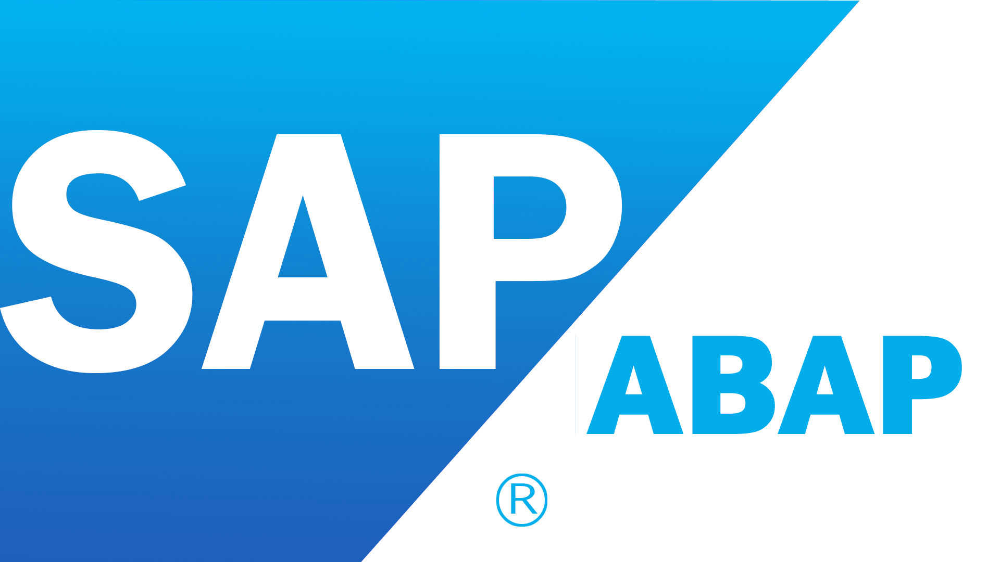

# ABAP BY CURIOUS ENGINEER
## CURIOUS ENGINEER- DEVELOPMENT CODE

PROGRAMS : 

1. INTERACTIVE ALV.
2. FACTORY METHOD USING ALV.
3. BAPI.
4. CORE ABAP BASIC PROGRAMS.
5. SALES ORDER PROCESSING.
6. LOCK OBJECT.
7. SIMPLE PROGRAM USING WRITE STATEMENT.
8. BDC PROGRAM.
9. SMARTFORM CALLING PROGRAM.
10. SIMPLE RADIO BUTTON.

😎 Follow me for more at : 
[LinkedIn](https://www.linkedin.com/in/rahulpillai200010)
